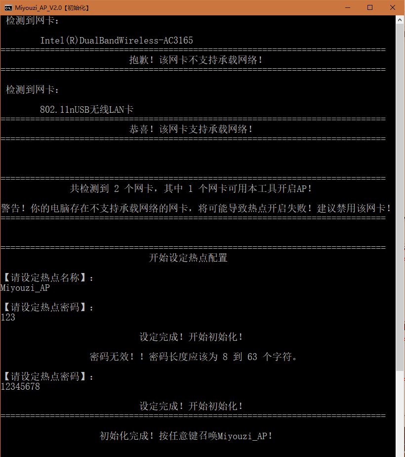
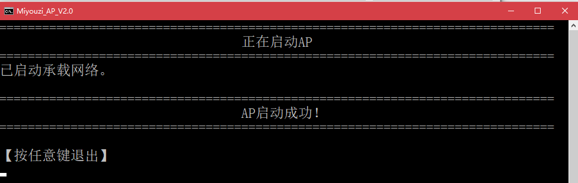
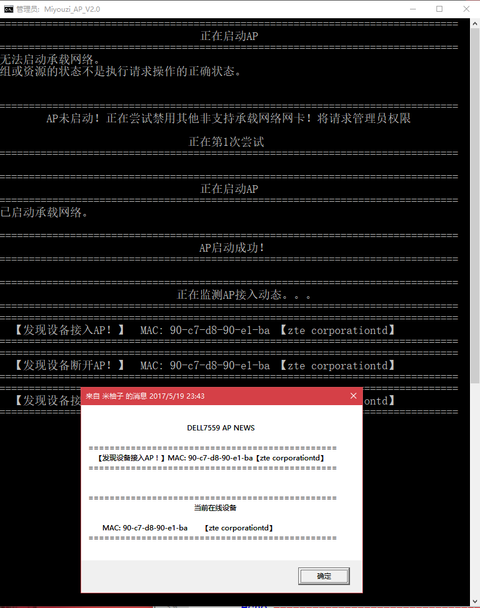
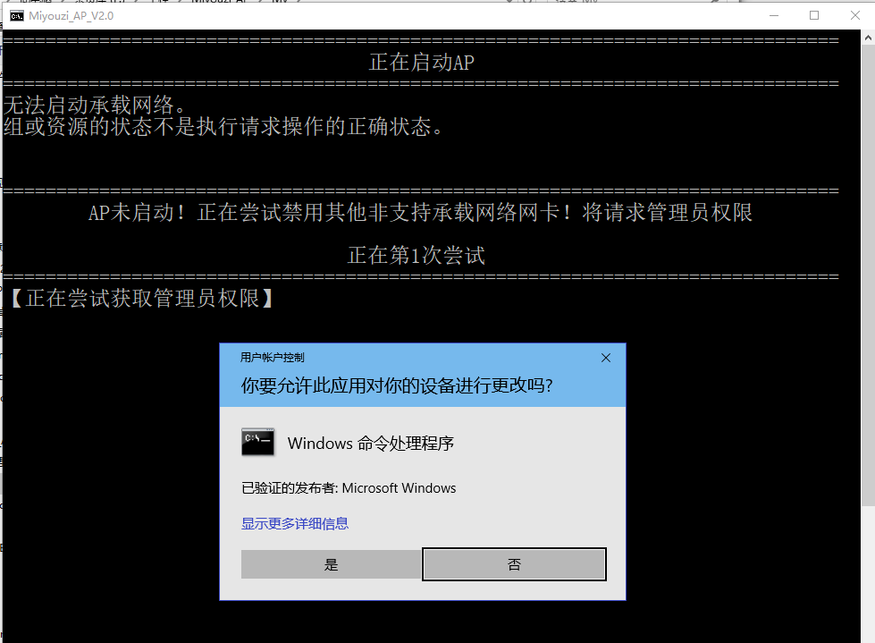
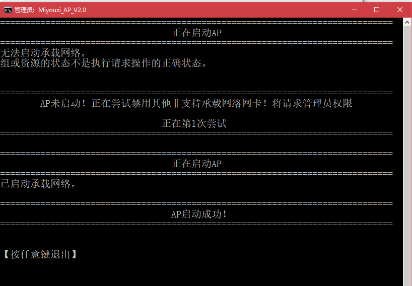
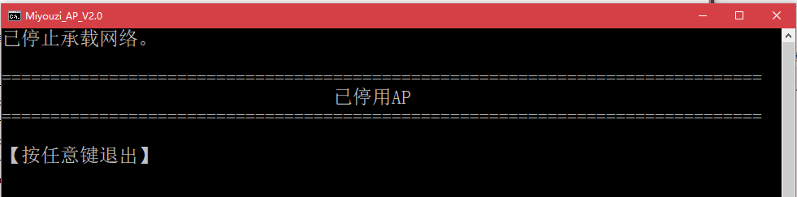

# 超轻量热点创建工具

###### Tags: `GitHub` `Miyouzi_AP` `Batch`

[**下载：Latest Release**](https://github.com/miyouzi/miyouzi_ap/releases)

**注意：该脚本仅适用Win7及以上简体中文系统使用**

## 更新记录
### V2.0更新-20170520
 - 添加功能：弹窗显示新接入设备（即第一次接入设备，若配合弹窗显示AP接入动态设为False，可实现仅在有新设备接入时弹窗提示）
 - 添加功能：启动失败时自动禁用不支持承载网络的网卡（若启动AP成功后会自动恢复）
 - 增强脚本稳定性。
 - 在启动AP前将检查是否存在启用的支持承载网络的网卡。
 - **【首次】AP初始化.bat** 添加密码长度有效性检查（8 到 63 个字符）。无效将引导用户重设。
 - **【管理员】【开机后台自启动热点】.bat** 与 **Miyouzi_AP.bat** 将会自行请求管理员权限，用户点击“是”即可，无需右键管理员运行。
 - **Miyouzi_AP.bat** 可接受参数(直接启动为启动AP但不监控)：
     - **start**　　　　后台运行监控
     - **stop**　　　　停用AP并终止监控
     - **monitor**　　　　前台运行监控

## 功能
 - 支持当有设备接入/断开热点是弹窗提醒（可关闭）。
 - 支持自动查询MAC。
 - 支持记录所有接入设备的MAC信息，并自动查询其网卡。
 - 陌生MAC查询后将记录在 **MyMacList.ini** ，未来该设备再次接入将直接提取 **MyMacList.ini** 里的记录。
 - 可编辑 **MyMacList.ini** ，更改已知MAC的信息为自己想要的备注。
 - 支持记录设备接入/断开的历史（可关闭）。
 - 支持设置Log大小上限。
 - 一键创建开机后台自起热点。（不影响弹窗提醒）。

## 使用
 - 首次使用请运行 **【首次】AP初始化.bat** ，该脚本将检查是否存在支持承载网络的无线网卡，若不存在，则本脚本不适用。若存在，则按提示设置 SSID及密码, 并将会生成 **UnsupportDevice.ini** 用于记录不支持承载网络的网卡的接口名称。设定完成后将启动 **Miyouzi_AP.bat** ，将生成配置文件 **settings.ini** 。
 - 打开 **settings.ini** ，按照说明进行配置并保存。
 - 启动 **Miyouzi_AP【启用监控】.bat** 将在前台运行监控工作，此时你可以观察其工作过程（是否有异常）。
 - 启动 **【管理员】【开机后台自启动热点】.bat** 将一键把启动AP加入开机任务。实现开机自启动AP并监控。

## 截图
 - 初始化AP

- 启动AP

- 监控AP

- AP启动失败时尝试提权（用以禁用不支持承载网络的无线网卡）

- AP启动失败时禁用不支持承载网络的无线网卡并重试

- 停用AP
